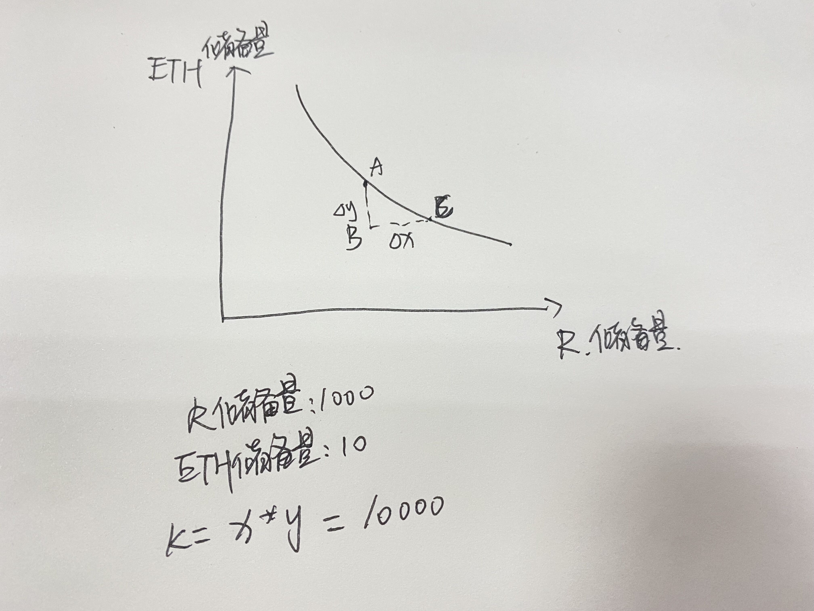
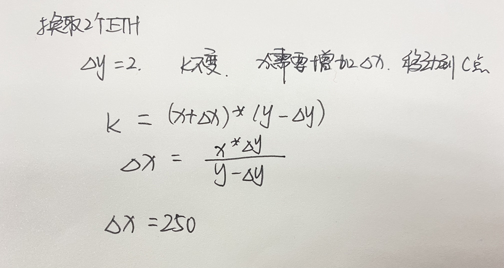
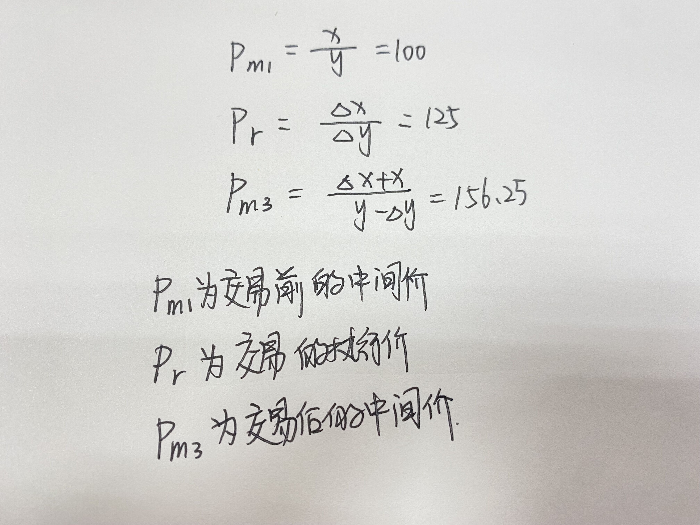

# uniswap v1原理

## 简介：
Uniswap 本质上是一个自动的交易所，能够自动地和用户交互并兑换ETH和ERC-20代币，兑换比例的确定（即*价格*）采用恒定乘积自动做市系统（constant-product automated market maker），也就是说，交易所资金池内的ETH和ERC-20代币数量的乘积总体是恒定的。

DeFi领域最具影响力的创新之一是自动化做市商(AMM), 同时AMM也是去中心化交易所（DEX）最为关键的技术之一。Uniswap爆发式增长，迅速成长为DeFi龙头，v1版本作为一个概念验证版本，代码也最简单，最适合入门，下面介绍v1

## 自动化做市商
#### 流动性提供者
通过智能合约实现市商功能，流动性提供者将持有的资产存入智能合约，合约按照预先设定的规则与买卖双方完成交易，并将交易手续费支付给流动性提供者

任何人都可以在uniswap上创建流动池，一个流动池由一个代币对构成。

假如你有一个项目发行了R代币,你就可以创建ETH/R的TokenPair为你的代币提供流动性。价格就是根据你提供两种代币的数量比值确定的。

如果你提供10个ETH，1000个R，那么中间价就是1R=0.01ETH.

但是价格不是一成不变的，他是需要反映供需关系的。当R增加时，他的价格就会降低。

#### 怎样计算的呢？
**恒定乘积公式： x × y=k (x和y分别是两种代币的储备量，交易时保持k不变。)**

如果换取2个ETH：

也就是说需要存入250个R。

再看下面三个公式：

中间价和执行价是不一样的，称作滑点。交易前后中间价变高了，这是反映了市场的供需关系。并且根据曲线看是不会出现流动性枯竭的，两种代币的储备是不会变成0的，随着储备量减少，价格会急剧上升。

除了流动性提供者（也就是上面那种情况），还有流动性添加者可以添加流动性

#### 流动性添加者
流动性添加者，也称为做市商。以R-ETH的池子为例，做市商往池子里添加这两种币种，并获得LP Token（做市凭证）。当他们取消做市的时候，把LP Token换成DAI和ETH，并同时获得做市期间获得的交易手续费。

在做市商提供了流动性以后，用户就可以和这个池子进行交易了，可以选择把DAI换成ETH，也可以把ETH换成DAI。交易的过程中，需要给流动性提供者支付手续费，目前是收取支付币种的0.3%。
## Uniswap V1存在的问题：

1.不能直接创建两种ERC20代币的流动性池，只能创建ETH和ERC20代币的流动性池.这样两种ERC20代币就不能直接兑换，需要通过ETH转换。

2.在实际的运行过程中，受制于以太坊吞吐量和速度的问题，Uniswap也遭遇过价格操纵的情况。
